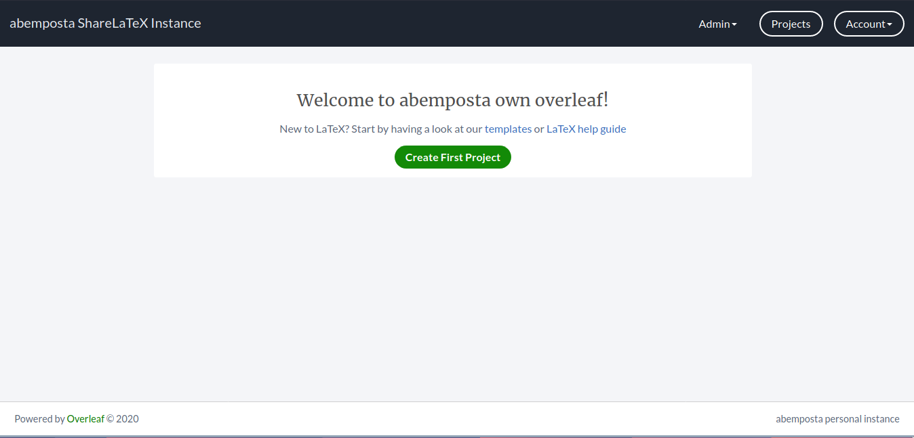

# Self-hosted overleaf automated with ansible and docker



This is a simple **ansible-playbook** that will install an [overleaf instance](https://github.com/overleaf/overleaf) on the server/servers of your liking using **docker-compose**.
The **docker-compose.yml** is almost the same as the example one provided in the [overleaf repo](https://github.com/overleaf/overleaf).
**Overleaf** has good docs on installing your personal instance, you may want to check it out [here](https://github.com/overleaf/overleaf/wiki/Quick-Start-Guide).
All the interesting files of this repo are under the **install** folder, and this readme assumes you are located there.


## Requirements
* A VPS or any computer for installing **Overleaf**.
* SSH connection to the target server.
* If you are not using the **root** user to connect, passwordless root access for the user.
* [Ansible](https://github.com/ansible/ansible) installed on your local machine.
* Docker and docker-compose previously installed in your server.

## Playbook vars

* Defined in `group_vars/latex.yml`. This are some parameters required for the installation that you **must** set.

* PATH VARS:
  * **compose_dir**: Path on the remote server where you keep or want to keep **compose** files for **docker services**.
  * **overleaf_dir**: Path where the **docker-compose.yml** for the **overleaf** service will be stored.

* DOCKER COMPOSE VARS:
  * **latexport**: Port where **overleaf** will be listening for connections.
  * **web_name**: Any name for your **overleaf** instance.
  * **disable_email_confirmation**: Keep this to **True**. Users will **not** get an email for registering.
  * **sharelatex_url**: URL where the your instance will be located. Useful if you have a **reverse proxy** set up.
  * **nav_title**: String of your liking for the navbar.
  * **header_image**: Image of your liking that will appear in the navbar (you can leave this blank).
  * **sharelatex_left_footer**: Personalized text appearing on the left side of the footer.
  * **sharelatex_right_footer**: Personalized text appearing on the right side of the footer.

## Usage
* First, clone this repository:
  ```
  git clone https://github.com/abemposta/ansible-overleaf
  ```
* Edit the **vars** according to your needs (located at `group_vars/latex.yml`
* Define your servers in the inventory file `production` in the group `latex`. Remember, you need to have **docker** and **docker-compose** installed on the server/servers, as well as passwordless root access.
* Launch the playbook: 
  ```
  ansible-playbook -i production latex.yml
  ```
* When the **stack** is installed, create an admin user at `/launchpad` (ie `http://localhost:8090/launchpad`).
